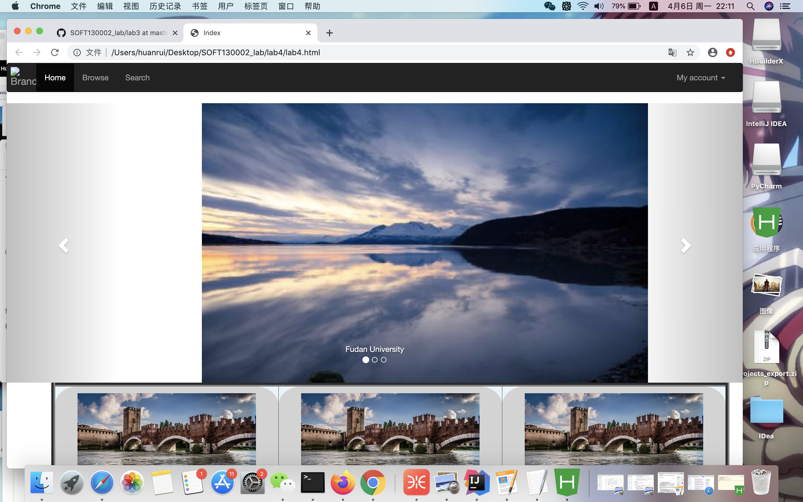

1、通过加入图片，并在css中利用position和left定位图片的位置。
2、在nav和foot中间加入table元素。
3、为table表格设置了边框和表格的背景颜色
4、在每个table中加入图片和TItle。在css中为图片和title设计了background和border-radius
5、为footer设置黑色背景
6、navbar-brand类设置了padding
7、js使用了官方的https://apps.bdimg.com/libs/jquery/2.1.4/jquery.min.js
8、bootstrap导入了bootstrap-3.3.7-dist/js/bootstrap.min.js使用
图片截图:
